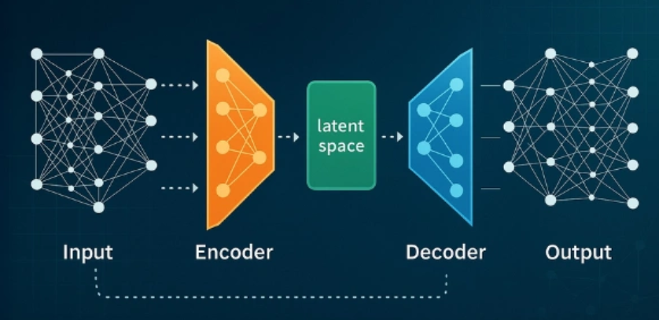

# AudoEncoders

Autoencoders is simply an architecture that compresses a latent space and reconstructs it back using that compressed latent space.

Here, we code audo encoders from scratch
our results: 
](images/reconstruction_results.png)