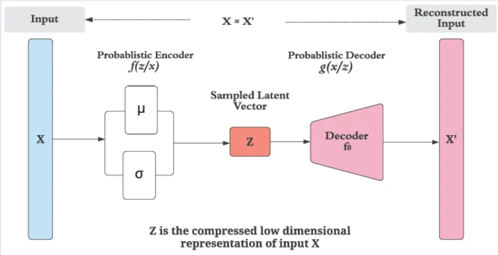
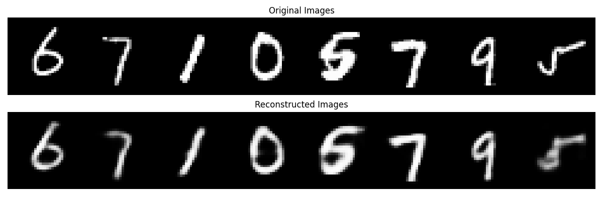
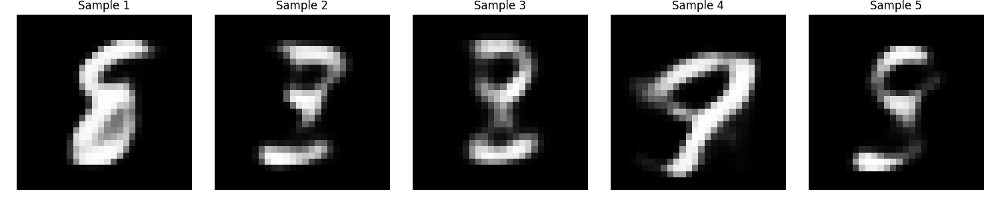

# Variational Autoencoders (VAE)

## why we need VAE (recap)

regular autoencoders fail at generation because the latent space isnt regularized. encoder maps inputs to single points, theres no structure between them, and sampling random points gives garbage outputs.

VAE fixes this by forcing the latent space to have a usable structure.

## the core idea

instead of the encoder outputting a single point in latent space, it outputs a **distribution**. specifically a gaussian, defined by two vectors:

- **μ (mu)**: the mean
- **σ (sigma)**: the standard deviation (or log variance, for numerical stability)

so each input doesnt get a single latent code, it gets a small "cloud" of possible codes. then we sample one point from that cloud and pass it to the decoder.

## architecture



flow:

1. input X goes into the probabilistic encoder
2. encoder outputs μ and σ (two vectors of the same dimensionality)
3. sample a latent vector z from N(μ, σ²)
4. decoder takes z and reconstructs X'

z is the compressed low dimensional representation, same as before, but now it comes from a distribution instead of being a fixed point.

## the reparameterization trick

theres a problem here. you cant backprop through a random sampling operation. gradients dont flow through "sample from a distribution".

the trick: instead of sampling z directly from N(μ, σ²), we compute it as:

```
z = μ + σ * ε     where ε ~ N(0, I)
```

now the randomness is isolated in ε (which we dont need gradients for), and μ and σ are just regular tensors that gradients can flow through. clean fix.

## loss function

two parts:

1. **reconstruction loss**: how well does the decoder reconstruct X from z. standard MSE or BCE depending on the data.
2. **KL divergence**: how far is the encoder's distribution N(μ, σ²) from a standard normal N(0, I).

total loss = reconstruction_loss + KL_divergence

the KL term is the whole reason this works. it forces every input's encoded distribution to stay close to a unit gaussian. without it, the model would just collapse σ to 0 and behave like a regular autoencoder.

## why this actually fixes generation

because of the KL term:

- all encoded distributions get pulled toward N(0, I)
- they overlap and pack together densely instead of scattering
- the latent space becomes smooth and continuous
- you can sample z ~ N(0, I) at inference time and get a meaningful output
- nearby points in latent space decode to similar outputs (the smoothness we wanted)

now random sampling actually works.

## reconstruction quality

VAE reconstructs inputs decently:



original on top, reconstructed on bottom. structure is preserved, digits are recognizable.

## generation from random points

this is the part regular AE couldnt do. sample random z from the latent space, decode it, get something that looks like the training data:



these arent reconstructions of any specific input, theyre generated from random latent vectors. they look like digits, just not exact ones from the dataset.

## limitations

VAE outputs are noticeably **blurry** compared to other generative models like GANs. this happens because:

- the KL term forces encoded distributions to overlap
- the decoder ends up seeing slightly different z's for similar inputs across training
- it learns to output something like an "average" of plausible reconstructions
- averaging blurs sharp details

so VAE solves the generation problem but trades off some sharpness. GANs and diffusion models came later to address this.

## summary

| | autoencoder | VAE |
|---|---|---|
| encoder output | single point | distribution (μ, σ) |
| latent space | scattered, holes | smooth, continuous |
| random sampling | broken | works |
| reconstruction | sharp | slightly blurry |
| generation | no | yes |

VAE = autoencoder + probabilistic encoder + KL regularization. thats the whole story.